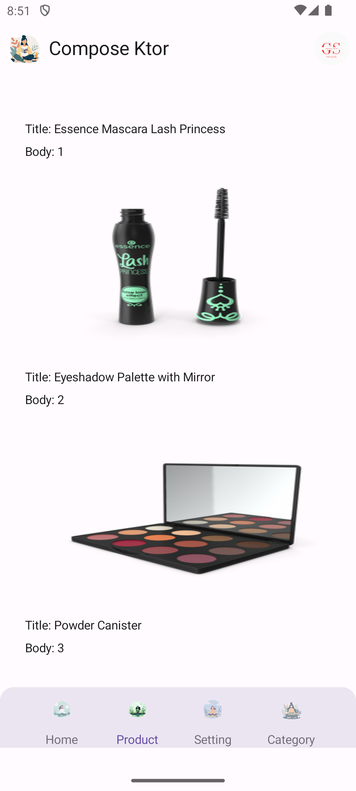

# 📱 Compose Ktor DI

   

A modern Android application using Jetpack Compose, Ktor, and Hilt for Dependency Injection.

## 🛠️ Tech Stack

- **Jetpack Compose** 🖌️ - Modern UI toolkit
- **Kotlin** 💻 - Programming language
- **Ktor** 🌍 - Asynchronous client-server framework
- **Hilt** 🔧 - Dependency Injection
- **Coroutines** ⚡ - Asynchronous programming
- **Coil** 🖼️ - Image loading library
- **DataStore** 💾 - Shared Preferences replacement

---

## 📦 Project Setup

### 🔌 Plugins Used
```kotlin
plugins {
//   alias(libs.plugins.android.application)
//    alias(libs.plugins.kotlin.android)
//    id("dagger.hilt.android.plugin")
//    id("com.google.dagger.hilt.android")
//    kotlin("plugin.serialization") version "1.9.0"
//    id("kotlin-parcelize")
//    kotlin("kapt")
}
```

### ✅ Enabling Kapt
```kotlin
kapt {
    correctErrorTypes = true
}
```

### ⚙️ Android Configuration
```kotlin
android {
    namespace = "geeky.saif.composektordi"
    compileSdk = 35
    
    defaultConfig {
        applicationId = "geeky.saif.composektordi"
        minSdk = 24
        targetSdk = 34
        versionCode = 1
        versionName = "1.0"

        testInstrumentationRunner = "androidx.test.runner.AndroidJUnitRunner"
        vectorDrawables {
            useSupportLibrary = true
        }
    }
    
    buildTypes {
        release {
            isMinifyEnabled = false
            proguardFiles(
                getDefaultProguardFile("proguard-android-optimize.txt"),
                "proguard-rules.pro"
            )
        }
    }
    
    compileOptions {
        sourceCompatibility = JavaVersion.VERSION_1_8
        targetCompatibility = JavaVersion.VERSION_1_8
    }
    
    kotlinOptions {
        jvmTarget = "1.8"
    }
    
    buildFeatures {
        compose = true
    }
    
    composeOptions {
        kotlinCompilerExtensionVersion = "1.5.1"
    }
    
    packaging {
        resources {
            excludes += "/META-INF/{AL2.0,LGPL2.1}"
        }
    }
}
```

---

## 📥 Dependencies
```kotlin
dependencies {
    // Core Libraries
    implementation(libs.androidx.core.ktx)
    implementation(libs.androidx.lifecycle.runtime.ktx)
    implementation(libs.androidx.activity.compose)
    implementation(platform(libs.androidx.compose.bom))
    implementation(libs.androidx.ui)
    implementation(libs.androidx.material3)
    
    // Navigation
    implementation (libs.androidx.navigation.compose)
    
    // Shared Preferences Replacement
    implementation(libs.androidx.datastore.preferences)

    // Ktor dependencies
    implementation(libs.ktor.client.core)
    implementation(libs.ktor.client.okhttp)
    implementation(libs.kotlinx.serialization.json)
    implementation(libs.ktor.client.content.negotiation)
    implementation(libs.ktor.serialization.kotlinx.json)

    // Kotlin Coroutines
    implementation(libs.kotlinx.coroutines.android)

    // Hilt for Dependency Injection
    implementation(libs.hilt.android)
    kapt(libs.hilt.compiler)

    // Jetpack Compose
    implementation(libs.androidx.lifecycle.viewmodel.compose)
    implementation(libs.androidx.hilt.navigation.compose)

    // Coil for Image Loading
    implementation(libs.coil.compose)
}
```

---

## 🚀 Getting Started
1. Clone this repository:
   ```sh
   git clone https://github.com/geekysaif/compose-ktor-di.git
   ```
2. Open in Android Studio 🛠️
3. Sync Gradle & Build the project ✅
4. Run the application ▶️

---

## Screenshots 📸
### Home Screen, Product Screens

<table>
  <tr>
    <td></td>
    <td></td>
  </tr>
  <tr>
    <td align="center"><b> News List Screen</b></td>
    <td align="center"><b>News Detail Screen</b></td>
  </tr>
</table>

---

Made with ❤️ by **Mohd Saif Alam**

